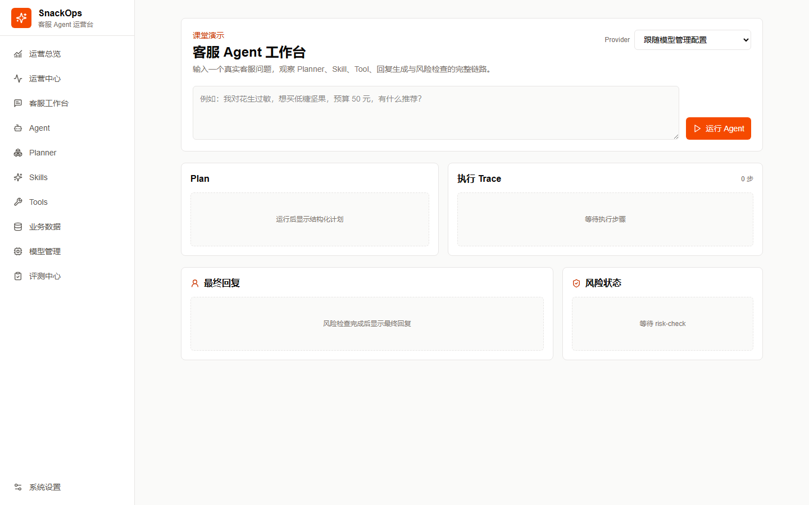
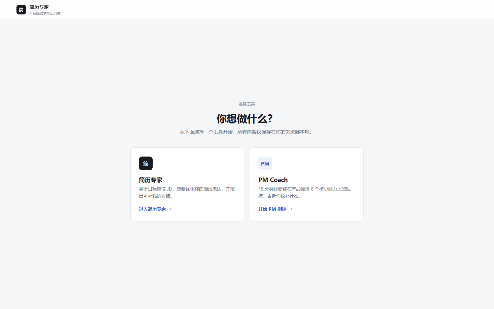

# 产品经理项目作品集

这里记录我独立完成的两个产品项目，重点展示从问题定义、需求设计到可运行版本交付的完整过程。

## 项目一：SnackOps

**零食电商客服 Agent 与运营评测平台**

面向客服运营场景，解决商品推荐、订单查询和售后回复依赖人工、回答口径难统一、效果难复盘的问题。

- 设计客服工作台、Coze Workflow 和 Planner 两种执行方式
- 梳理商品推荐、订单/物流、优惠、售后和投诉等核心流程
- 建立运行记录、人工标注、批次评测和 Bad Case 迭代闭环
- 使用 Vibe Coding 独立完成可运行 MVP

[查看项目案例](snackops/) · [查看源码](https://github.com/young-pig-boy/snackops)

## 项目二：简历专家

**基于目标 JD 的求职优化与产品经理能力测评工具**

面向求职与转行人群，解决通用简历工具不理解目标岗位、缺少能力诊断和事实依据的问题。

- 设计“能力测评—JD 分析—证据追问—简历优化—面试准备”主流程
- 建立基于错题证据的能力诊断和结构化简历生成机制
- 通过固定输出格式、证据追溯和异常提示，减少 AI 编造经历
- 使用 Vibe Coding 独立完成可运行 MVP

[查看项目案例](resume-expert/) · [查看源码](https://github.com/young-pig-boy/resume-expert)

## 我在项目中的工作方式

- 从用户问题和业务目标出发，明确 MVP 范围、核心链路和异常边界
- 用 PRD、原型和流程图把需求转成可实现的功能规则
- 为涉及模型的功能补充输入约束、结果校验、失败兜底和评测标准
- 通过真实测试和 Bad Case 记录持续调整产品方案

## 本地预览

在本目录的上一级启动静态服务器后访问：

- 作品集首页：`http://localhost:8080/作品集/`
- SnackOps：`http://localhost:8080/作品集/snackops/`
- 简历专家：`http://localhost:8080/作品集/resume-expert/`

## 公开说明

本仓库是脱敏后的静态作品集，不包含项目运行所需的 API Key、访问令牌、私人联系方式、真实订单或本地配置。完整可运行源码分别位于两个独立仓库，运行配置请以各自 README 为准。

投递时可使用：`项目作品集：总览链接｜SnackOps｜简历专家`。
